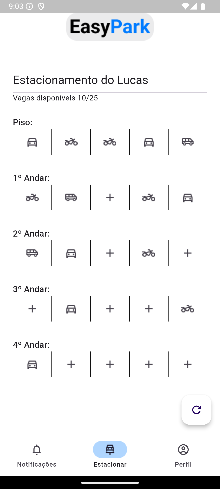
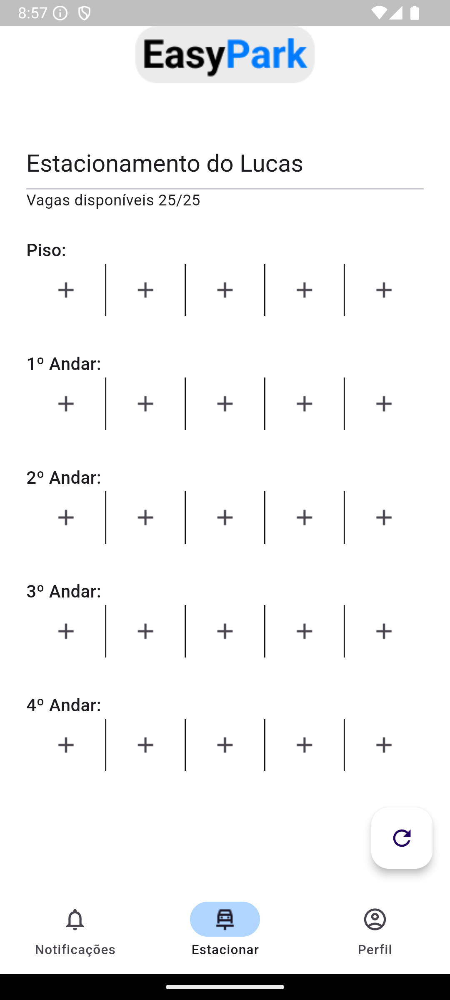
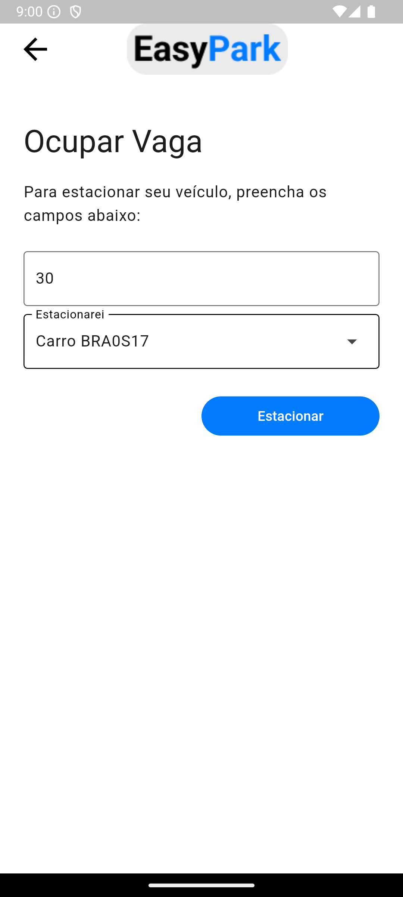
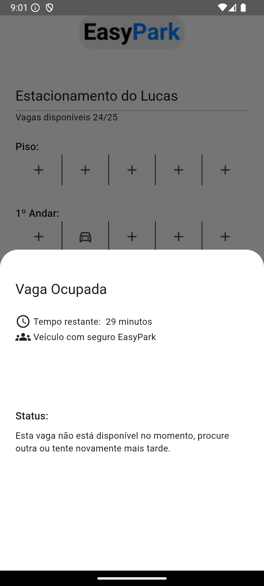

# EasyPark - Gerenciamento de Estacionamentos


[](https://bitbucket.org/lbesson/ansi-colors)


**EasyPark** é o MVP vencedor do Hackathon SCEG do IFF campus Bom Jesus do Itabapoana. Nossa solução visa facilitar o gerenciamento de estacionamentos, oferecendo uma ferramenta simples e intuitiva, especialmente voltada para negócios de pequeno e médio porte.

## Layout 
<div style="display: flex; gap: 10px;">
   
   
   
   
</div>

## Funcionalidades Principais

- **Interface Intuitiva**: Cada botão no app representa uma vaga de estacionamento. Todo o estacionamento, incluindo andares, vagas livres e ocupadas, pode ser visualizado diretamente na tela principal.
- **Gestão de Veículos**: Visualização do tempo restante de cada veículo estacionado, a partir do cadastro de veículos dos usuários.
- **Ocupação em Tempo Real**: Monitore a disponibilidade das vagas dando refresh em tempo real, facilitando o controle e a operação do estacionamento.
- **Experiência Contínua**: O estado do estacionamento é conservado entre as sessões, proporcionando uma experiência de uso contínua e eficiente.

## Monetização

- **Taxa de Uso**: Nossa monetização se dá a partir de uma pequena taxa aplicada sobre o lucro do estacionamento, cobrando diretamente do dono do estabelecimento por cada utilização do app.
- **Assinatura de Proteção de Veículos**: Oferecemos uma assinatura mensal opcional para os clientes, onde o proprietário do estacionamento assume a responsabilidade por danos aos veículos e, em contrapartida, fica isento das taxas do app.

## Tecnologias Utilizadas

- **Flutter**: Framework utilizado para a criação de um aplicativo multiplataforma, disponível para Android e iOS.
- **Shared Preferences**: Implementado para a persistência de dados locais entre as sessões.
- **Design Modular**: Arquitetura limpa e escalável, separando a lógica de negócios da interface gráfica.

## Como Executar o Projeto

1. Clone o repositório:
   ```bash
   git clone https://github.com/matheusbor/Hackathon-EasyPark.git
   ```
2. Instale as dependências:
   ```bash
   flutter pub get
   ```
3. Execute o aplicativo:
   ```bash
   flutter run
   ```
### Ou instale as builds abaixo:

- [Versão para Android](https://drive.google.com/file/d/13X_4NQu28WVK0-FJfIblNRerVFoeAZk-/view?usp=sharing)
